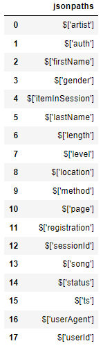

# Project: Data Warehouse

## Introduction

A music streaming startup, Sparkify, has grown their user base and song database and want to move their processes and data onto the cloud. Their data resides in S3, in a directory of JSON logs on user activity on the app, as well as a directory with JSON metadata on the songs in their app.

As their data engineer, you are tasked with building an ETL pipeline that extracts their data from S3, stages them in Redshift, and transforms data into a set of dimensional tables for their analytics team to continue finding insights into what songs their users are listening to.

<figure>
  
</figure>


## Project Description
In this project, you'll apply what you've learned on data warehouses and AWS to build an ETL pipeline for a database hosted on Redshift. To complete the project, you will need to load data from S3 to staging tables on Redshift and execute SQL statements that create the analytics tables from these staging tables.

## Project Datasets
You'll be working with two datasets stored in S3. Here are the S3 links for each:

- Song data: s3://udacity-dend/song_data
- Log data: s3://udacity-dend/log_data

To properly read log data s3://udacity-dend/log_data, you'll need the following metadata file:

- Log metadata: s3://udacity-dend/log_json_path.json

Keep in mind that the udacity-dend bucket is situated in the us-west-2 region. If you're copying the dataset to Redshift located in us-east-1, remember to specify the region using the REGION keyword in the COPY command.

### Song Dataset
The first dataset is a subset of real data from the Million Song Dataset(opens in a new tab). Each file is in JSON format and contains metadata about a song and the artist of that song. The files are partitioned by the first three letters of each song's track ID. For example, here are file paths to two files in this dataset.

- song_data/A/B/C/TRABCEI128F424C983.json
- song_data/A/A/B/TRAABJL12903CDCF1A.json

And below is an example of what a single song file, TRAABJL12903CDCF1A.json, looks like.

```
{"num_songs": 1, "artist_id": "ARJIE2Y1187B994AB7", "artist_latitude": null, "artist_longitude": null, "artist_location": "", "artist_name": "Line Renaud", "song_id": "SOUPIRU12A6D4FA1E1", "title": "Der Kleine Dompfaff", "duration": 152.92036, "year": 0} 
```

### Log Dataset
The second dataset consists of log files in JSON format generated by this event simulator(opens in a new tab) based on the songs in the dataset above. These simulate app activity logs from an imaginary music streaming app based on configuration settings.

The log files in the dataset you'll be working with are partitioned by year and month. For example, here are file paths to two files in this dataset.

- log_data/2018/11/2018-11-12-events.json
- log_data/2018/11/2018-11-13-events.json

And below is an example of what the data in a log file, 2018-11-12-events.json, looks like.

<figure>
  
</figure>

### Log JSON Metadata
The log_json_path.json file is used when loading JSON data into Redshift. It specifies the structure of the JSON data so that Redshift can properly parse and load it into the staging tables.

In the context of this project, you will need the log_json_path.json file in the COPY command, which is responsible for loading the log data from S3 into the staging tables in Redshift. The log_json_path.json file tells Redshift how to interpret the JSON data and extract the relevant fields. This is essential for further processing and transforming the data into the desired analytics tables.

Below is what data is in log_json_path.json.

<figure>
  
</figure>

## Schema for Song Play Analysis
Using the song and event datasets, you'll need to create a star schema optimized for queries on song play analysis. This includes the following tables.

### Staging Tables
- staging_events - artist, auth, firstName, gender, itemInSession, lastName, length, level, location, method, page, registration, sessionId, song, status, ts, userAgent, userId
- staging_songs - artist_latitude, artist_longitude, artist_location, artist_name, song_id, title, duration, year, num_songs, artist_id

### Fact Table
- songplays - records in event data associated with song plays i.e. records with page NextSong
songplay_id, start_time, user_id, level, song_id, artist_id, session_id, location, user_agent

### Dimension Tables
- users - users in the app
user_id, first_name, last_name, gender, level
- songs - songs in music database
song_id, title, artist_id, year, duration
- artists - artists in music database
artist_id, name, location, latitude, longitude
- time - timestamps of records in songplays broken down into specific units
start_time, hour, day, week, month, year, weekday